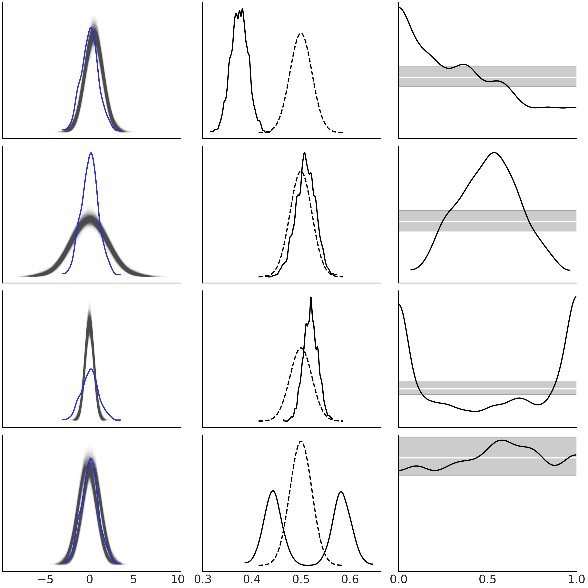

---
jupyter:
  jupytext:
    text_representation:
      extension: .md
      format_name: markdown
      format_version: '1.3'
      jupytext_version: 1.11.2
  kernelspec:
    display_name: Poetry
    language: python
    name: poetry-kernel
---

# Exploratory analysis of Bayesian models

## Life after inference

## Understanding your assumptions

**Prior predictive checks**
are computing a prior predictive distribution by sampling from the model
without taking into account the data.
This can be used to understand affects of choices of priors.

If priors give bad values:

- Rethinkg model
- Use prior that reduces invalid results
- See if data is informative enough to exclude nonsensical values

For example a logistic regression
can favor more and more extreme values
as the number of predictors increases.
A strong regularizing prior—like
the Laplace distribution—
can keep model away from extreme values.

### Understanding your predictions

**Posterior predictive checks**
evaluate how close the synthetic observations are
to the actual observations.

Can plot them againt each other to visially inspect,
or use Baeysian p-value—probability
that simulated test statistic $T_{sim}$
is less or equal than the observed statistic $T_{obs}$.
Usually the ideal value is $p_{B} = 0.5$—half
the time it's below,
and the other half above.

$$
p_{B} = p(T_{sim} \leq T_{obs} \mid \tilde Y)
$$

Can plot with `az.plot_bpv(..., kind="p_value")`.

Arviz funcitons for plots:

- **`az.plot_ppc(..)`**
  plots generated model data vs actual data
- **`az.plot_bpv(..., kind="p_values")`**
  plots the proportion of predicted values
  that are less than or equal to the observed data (p-value)
  compared to the expected distribution for a dataset of the same size
  as the observed data
- **`az.plot_bpv(..., kind="u_values")`**
  plots the proportion of predicted values that are less or equal than the observed per observation.
  Ideal case is white line—a uniform distribution.
  Grey band is where we expect to see 94% of Uniform-like curves,
  even good models have deviations from a perfect Uniform.

