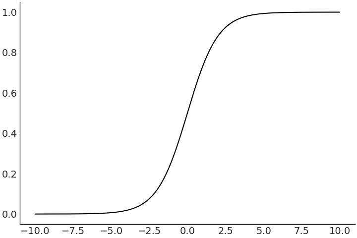
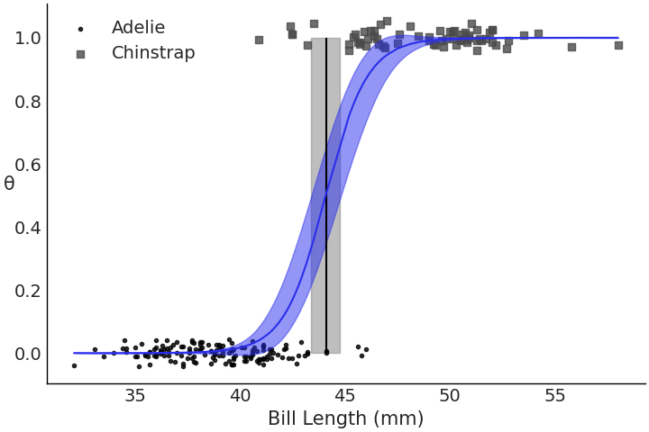
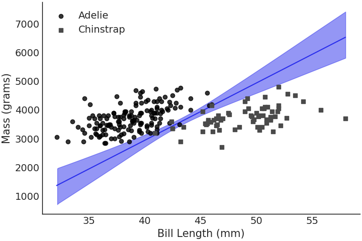

---
jupyter:
  jupytext:
    text_representation:
      extension: .md
      format_name: markdown
      format_version: '1.3'
      jupytext_version: 1.11.2
  kernelspec:
    display_name: Poetry
    language: python
    name: poetry-kernel
---

# Linear models and probabalistic programming languages


## Imports

```python
%config InlineBackend.figure_format="retina"
```

```python tags=[]
import arviz as az
import bambi as bmb
import matplotlib.pyplot as plt
import numpy as np
import pandas as pd
import pymc3 as pm
import tensorflow as tf
import tensorflow_probability as tfp
from pandas import DataFrame
from scipy import special
from tensorflow_probability import distributions as tfd
```

## Comparing two or more groups

```python
penguins = pd.read_csv(
    "https://raw.githubusercontent.com/BayesianModelingandComputationInPython"
    "/BookCode_Edition1/main/data/penguins.csv"
).dropna(subset=["bill_length_mm", "flipper_length_mm", "sex", "body_mass_g"])
summary_stats = penguins.groupby("species")["body_mass_g"].agg(["mean", "std", "count"])
summary_stats
```

Get uncertainty of above statistics

$$
\overbrace{p(\mu, \sigma \mid Y)}^{Posterior} \propto \overbrace{\mathcal{N}(Y \mid \mu, \sigma)}^{Likelihood}\;  \overbrace{\underbrace{\mathcal{N}(4000, 3000)}_{\mu}
     \underbrace{\mathcal{H}\text{T}(100, 2000)}_{\sigma}}^{Prior}
$$

```python
adelie_mass_obs = penguins.loc[adelie_mask, "body_mass_g"].to_numpy()

with pm.Model() as model_adelie_penguin_mass:
    σ = pm.HalfStudentT("σ", 100, 2_000)
    μ = pm.Normal("μ", 4_000, 3_000)
    mass = pm.Normal("mass", mu=μ, sigma=σ, observed=adelie_mass_obs)

    prior = pm.sample_prior_predictive(samples=5_000)
    trace = pm.sample(chains=4)
    inf_data_adelie_penguin_mass = az.from_pymc3(prior=prior, trace=trace)
```

```python
az.plot_posterior(inf_data_adelie_penguin_mass["prior"], var_names=["σ", "μ"]);
```

```python
az.summary(inf_data_adelie_penguin_mass)
```

```python
_, axes = plt.subplots(2, 2, figsize=(20, 7))
az.plot_trace(
    inf_data_adelie_penguin_mass, divergences="bottom", kind="rank_bars", axes=axes
)
plt.tight_layout();
```

```python
az.plot_posterior(inf_data_adelie_penguin_mass);
```

```python
all_species = pd.Categorical(penguins["species"])
with pm.Model(
    coords={"species": all_species.categories}
) as model_penguin_mass_all_species:
    σ = pm.HalfStudentT("σ", 100, 2_000, dims="species")
    μ = pm.Normal("μ", 4_000, 3_000, dims="species")
    mass = pm.Normal(
        "mass",
        mu=μ[all_species.codes],
        sigma=σ[all_species.codes],
        observed=penguins["body_mass_g"],
    )
    trace = pm.sample()
    inf_data_model_penguin_mass_all_species = az.from_pymc3(trace=trace)
```

```python
_, axes = plt.subplots(all_species.categories.shape[0] * 2, 2, figsize=(20, 20))
az.plot_trace(
    inf_data_model_penguin_mass_all_species,
    compact=False,
    divergences="bottom",
    kind="rank_bars",
    axes=axes,
)
plt.tight_layout();
```

```python
az.plot_forest(inf_data_model_penguin_mass_all_species, var_names=["μ"]);
```

```python
az.plot_forest(inf_data_model_penguin_mass_all_species, var_names=["σ"]);
```

### Comparing two PPLs

```python
root = tfd.JointDistributionCoroutine.Root

species_idx = tf.constant(all_species.codes, tf.int32)
body_mass_g = tf.constant(penguins["body_mass_g"], tf.float32)

number_of_species = all_species.categories.shape[0]


@tfd.JointDistributionCoroutine
def jd_penguin_mass_all_species():
    σ = yield root(
        tfd.Sample(
            tfd.HalfStudentT(df=100, loc=0, scale=2_000),
            sample_shape=number_of_species,
            name="sigma",
        )
    )
    μ = yield root(
        tfd.Sample(
            tfd.Normal(loc=4_000, scale=3_000),
            sample_shape=number_of_species,
            name="mu",
        )
    )
    mass = yield tfd.Independent(
        tfd.Normal(
            loc=tf.gather(μ, species_idx, axis=-1),
            scale=tf.gather(σ, species_idx, axis=-1),
        ),
        reinterpreted_batch_ndims=1,
        name="mass",
    )

prior_predictive_samples = jd_penguin_mass_all_species.sample(1000)
```

`tfd.Independent` is used to indicate
that the distribution contains multiple copies
that we would like to sum over some axis—specified
by `reinterpreted_batch_ndims` arg—when
computing log-likelihood.

`.sample` can draw conditional samples.

```python
jd_penguin_mass_all_species.sample(sigma=tf.constant([.1, .2, .3]))
```

```python
target_density_function = lambda *x: jd_penguin_mass_all_species.log_prob(
    *x, mass=body_mass_g
)

jd_penguin_mass_observed = jd_penguin_mass_all_species.experimental_pin(
    mass=body_mass_g
)
target_density_function = jd_penguin_mass_observed.unnormalized_log_prob

run_mcmc = tf.function(
    tfp.experimental.mcmc.windowed_adaptive_nuts, autograph=False, jit_compile=True
)
mcmc_samples, sampler_stats = run_mcmc(
    1_000,
    jd_penguin_mass_all_species,
    n_chains=4,
    num_adaptation_steps=1_000,
    mass=body_mass_g,
)
inf_data_model_penguin_mass_all_species2 = az.from_dict(
    posterior={
        # TFP mcmc returns (num_samples, num_chains, ...), we swap
        # the first and second axis below for each RV so the shape
        # is what ArviZ expected.
        k: np.swapaxes(v, 1, 0)
        for k, v in mcmc_samples._asdict().items()
    },
    sample_stats={
        k: np.swapaxes(sampler_stats[k], 1, 0)
        for k in ["target_log_prob", "diverging", "accept_ratio", "n_steps"]
    },
)
```

```python
prior_predictive_samples = jd_penguin_mass_all_species.sample([1, 1_000])
dist, samples = jd_penguin_mass_all_species.sample_distributions(value=mcmc_samples)
ppc_samples = samples[-1]
ppc_distribution = dist[-1].distribution
data_log_likelihood = ppc_distribution.log_prob(body_mass_g)

# Be careful not to run this code twice during REPL workflow.
inf_data_model_penguin_mass_all_species2.add_groups(
    prior=prior_predictive_samples[:-1]._asdict(),
    prior_predictive={"mass": prior_predictive_samples[-1]},
    posterior_predictive={"mass": np.swapaxes(ppc_samples, 1, 0)},
    log_likelihood={"mass": np.swapaxes(data_log_likelihood, 1, 0)},
    observed_data={"mass": body_mass_g},
)
```

## Linear regression


$$
\begin{split}
    \mu =& \beta_0 + \beta_1 X_1 + \dots + \beta_m X_m \\
Y \sim& \mathcal{N}(\mu, \sigma)
\end{split}
$$

or

$$
\mu = \mathbf{X}\boldsymbol{\beta}
$$

 $\mathbf{X}$ is known as the **design matrix**.
 
 


### Linear penguins

```python
def adelie_mask(penguins_df: DataFrame) -> DataFrame:
    """Create mask to select only Adelie penguins."""
    adelie_penguins_mask = penguins_df["species"] == "Adelie"
    return adelie_penguins_mask

adelie_flipper_length_obs = penguins.loc[
    adelie_mask, "flipper_length_mm"
]

with pm.Model() as model_adelie_flipper_regression:
    adelie_flipper_length = pm.Data(
        "adelie_flipper_length", value=adelie_flipper_length_obs
    )
    σ = pm.HalfStudentT("σ", nu=100, sigma=2_000)
    β_0 = pm.Normal("β_0", mu=0, sigma=4_000)
    β_1 = pm.Normal("β_1", mu=0, sigma=4_000)
    μ = pm.Deterministic("μ", var=β_0 + β_1 * adelie_flipper_length)

    mass = pm.Normal("mass", mu=μ, sigma=σ, observed=adelie_mass_obs)

    inf_data_adelie_flipper_regression = pm.sample(return_inferencedata=True)

az.plot_posterior(inf_data_adelie_flipper_regression, var_names=["β_0", "β_1"]);
```

```python
az.plot_forest(
    [inf_data_adelie_penguin_mass, inf_data_adelie_flipper_regression],
    model_names=["mass_only", "flipper_regression"],
    var_names=["σ"],
    combined=True,
);
```

Incorperating covariate resulted in better predictions
See reduction of $\sigma$.

```python
inf_data_adelie_flipper_regression["posterior"].mean()["β_0"].values.item()
```

```python
_, ax = plt.subplots(figsize=(20, 7))
alpha_m = inf_data_adelie_flipper_regression["posterior"].mean()["β_0"].values.item()
beta_m = inf_data_adelie_flipper_regression["posterior"].mean()["β_1"].values.item()
flipper_length = np.linspace(
    adelie_flipper_length_obs.min(), adelie_flipper_length_obs.max(), 100
)
mass_mean = alpha_m + beta_m * flipper_length
ax.plot(flipper_length, mass_mean, color="C2")
ax.scatter(x=adelie_flipper_length_obs, y=adelie_mass_obs)
az.plot_hdi(
    x=adelie_flipper_length_obs,
    y=inf_data_adelie_flipper_regression["posterior"]["μ"],
    ax=ax,
);
```

### Predictions

```python
with model_adelie_flipper_regression:
    # Predict mass for panguin with average flipper length
    pm.set_data({"adelie_flipper_length": [adelie_flipper_length_obs.mean()]})
    posterior_predictions = pm.sample_posterior_predictive(
        inf_data_adelie_flipper_regression["posterior"], var_names=["mass", "μ"]
    )
_, ax = plt.subplots(figsize=(20, 7))
az.plot_dist(
    posterior_predictions["mass"],
    label="Posterior Predictive of \nIndividual Penguin Mass",
)
az.plot_dist(
    posterior_predictions["μ"],
    label="Posterior Predictive of μ",
    color="C1"
)
ax.legend(loc=1)
```

### Centering


Above,
$\beta_0$ is mostly negative,
and its interpretation is not very useful.
Can center data
by subtrating the mean from it.
This does not affect $\beta_1$,
but now $\beta_0$ is the distribution of the mean masses for penguins with mean flipper length.
Can also subtract the minimum flipper length—which
woudl result in $\beta_0$ being the mass distribution for the smallest oberved flipper length.

```python
adelie_flipper_length_c = adelie_flipper_length_obs - adelie_flipper_length_obs.mean()


def gen_adelie_flipper_model(adelie_flipper_length):
    adelie_flipper_length = tf.constant(adelie_flipper_length, tf.float32)

    @tfd.JointDistributionCoroutine
    def jd_adelie_flipper_regression():
        σ = yield root(tfd.HalfStudentT(df=100, loc=0, scale=2_000, name="sigma"))
        β_1 = yield root(tfd.Normal(loc=0, scale=4_000, name="beta_1"))
        β_0 = yield root(tfd.Normal(loc=0, scale=4_000, name="beta_0"))
        μ = β_0[..., None] + β_1[..., None] * adelie_flipper_length
        mass = yield tfd.Independent(
            tfd.Normal(loc=μ, scale=σ[..., None]),
            reinterpreted_batch_ndims=1,
            name="mass",
        )

    return jd_adelie_flipper_regression


jd_adelie_flipper_regression = gen_adelie_flipper_model(adelie_flipper_length_c)
mcmc_samples, sampler_stats = run_mcmc(
    1_000,
    jd_adelie_flipper_regression,
    n_chains=4,
    num_adaptation_steps=1_000,
    mass=tf.constant(adelie_mass_obs, tf.float32),
)

inf_data_adelie_flipper_length_c = az.from_dict(
    posterior={
        key: np.swapaxes(value, 1, 0) for key, value in mcmc_samples._asdict().items()
    },
    sample_stats={
        key: np.swapaxes(sampler_stats[key], 1, 0)
        for key in ["target_log_prob", "diverging", "accept_ratio", "n_steps"]
    },
)
az.plot_posterior(inf_data_adelie_flipper_length_c, var_names=["beta_0", "beta_1"]);
```

## Multiple linear regression

```python
sex_obs = penguins.loc[adelie_mask, "sex"].replace(
    {"male": 0, "female": 1}
)

with pm.Model() as model_penguin_mass_categorical:
    σ = pm.HalfStudentT("σ", nu=100, sigma=2_000)
    β_0 = pm.Normal("β_0", mu=0, sigma=3_000)
    β_1 = pm.Normal("β_1", mu=0, sigma=3_000)
    β_2 = pm.Normal("β_2", mu=0, sigma=3_000)

    μ = pm.Deterministic("μ", var=β_0 + β_1 * adelie_flipper_length_obs + β_2 * sex_obs)
    mass = pm.Normal("mass", mu=μ, sigma=σ, observed=adelie_mass_obs)

    inf_data_penguin_mass_categorical = pm.sample(
        target_accept=0.9, return_inferencedata=True
    )

az.plot_posterior(inf_data_penguin_mass_categorical, var_names=["β_0", "β_1", "β_2"]);
```

Bambi version of model.
Priors are automatically assigned.

```python
bambi_model = bmb.Model(
    "body_mass_g ~ flipper_length_mm + sex", penguins.loc[adelie_mask]
)
bambi_trace = bambi_model.fit()
az.plot_posterior(bambi_trace, var_names=["Intercept", "flipper_length_mm", "sex"]);
```

Since male is encoded as 0.
$\beta_2$ estiamtes the difference in mass compared to a female
with the same flipper length.

```python
inf_data_adelie_flipper_regression
```

Standard deviation shows reduced variance.

```python
az.plot_forest(
    [
        inf_data_adelie_penguin_mass,
        inf_data_adelie_flipper_regression,
        inf_data_penguin_mass_categorical,
    ],
    model_names=["mass_only", "flipper_regression", "flipper_sex_regression"],
    var_names=["σ"],
    combined=True,
);
```

### Counterfactuals


We can hold all covariats constant except one
to see how chaniging one covariate changes our expected outcome.
This is a **counterfactual analysys**.

Caveats:

- You can set values that are impossible
- You make the assumption that you can vary covariates independently—ie
  they are not coorelated with each other.

```python
def gen_jd_flipper_bill_sex(flipper_length, sex, bill_length, dtype=tf.float32):
    flipper_length, sex, bill_length = tf.nest.map_structure(
        lambda x: tf.constant(x, dtype), (flipper_length, sex, bill_length)
    )

    @tfd.JointDistributionCoroutine
    def jd_flipper_bill_sex():
        σ = yield root(tfd.HalfStudentT(df=100, loc=0, scale=2000, name="sigma"))
        β_0 = yield root(tfd.Normal(loc=0, scale=3000, name="beta_0"))
        β_1 = yield root(tfd.Normal(loc=0, scale=3000, name="beta_1"))
        β_2 = yield root(tfd.Normal(loc=0, scale=3000, name="beta_2"))
        β_3 = yield root(tfd.Normal(loc=0, scale=3000, name="beta_3"))
        μ = (
            β_0[..., None]
            + β_1[..., None] * flipper_length
            + β_2[..., None] * sex
            + β_3[..., None] * bill_length
        )
        mass = yield tfd.Independent(
            tfd.Normal(loc=μ, scale=σ[..., None]),
            reinterpreted_batch_ndims=1,
            name="mass",
        )

    return jd_flipper_bill_sex


bill_length_obs = penguins.loc[adelie_mask, "bill_length_mm"]
jd_flipper_bill_sex = gen_jd_flipper_bill_sex(
    adelie_flipper_length_obs, sex_obs, bill_length_obs
)

mcmc_samples, sampler_stats = run_mcmc(
    1000,
    jd_flipper_bill_sex,
    n_chains=4,
    num_adaptation_steps=1000,
    mass=tf.constant(adelie_mass_obs, tf.float32),
)

mean_flipper_length = penguins.loc[adelie_mask, "flipper_length_mm"].mean()
# Counterfactual dimensions is set to 21 to allow us to get the mean exactly
counterfactual_flipper_lengths = np.linspace(
    mean_flipper_length - 20, mean_flipper_length + 20, 21
)
sex_male_indicator = np.zeros_like(counterfactual_flipper_lengths)
mean_bill_length = np.ones_like(counterfactual_flipper_lengths) * bill_length_obs.mean()

jd_flipper_bill_sex_counterfactual = gen_jd_flipper_bill_sex(
    counterfactual_flipper_lengths, sex_male_indicator, mean_bill_length
)
ppc_samples = jd_flipper_bill_sex_counterfactual.sample(value=mcmc_samples)
estimated_mass = ppc_samples[-1].numpy().reshape(-1, 21)

_, ax = plt.subplots(figsize=(20, 7))
az.plot_hdi(counterfactual_flipper_lengths, estimated_mass, ax=ax)
ax.plot(counterfactual_flipper_lengths, estimated_mass.mean(axis=0), lw=4)
ax.set_xlabel("Counterfactual flipper length")
ax.set_ylabel("Mass")
```

## Generalized linear models


We may want to use non-normal distributions.
Use **inverse link function** $\phi$:

$$
\mu = \phi(\mathbf{X} \beta) 
$$
$$
Y \sim \Psi (\mu, \theta)
$$

Traditionally **link functions** are applied to left hand side of equation.


### Logistic regression


Used when there are only two possible outcomes,
maps $(-\infty, \infty)$ to $(0,1)$
and uses $logstic$ function as inverse link function.
$logit$ is the link function.

$$
p = \frac{1}{1+e^{-\mathbf{X}\beta}}
$$




### Classifying penguins


Given mass, sex, and bill length
can you predict species?

If we set decision boundary to 0.5

$$
\begin{split}
0.5 &= logistic(\beta_{0} + \beta_{1}*x) \\
logit(0.5) &= \beta_{0} + \beta_{1}*x \\
0 &= \beta_{0} + \beta_{1}*x \\
x &= -\frac{\beta_{0}}{\beta_{1}} \\
\end{split}
$$

```python
def species_filter(penguins_df: DataFrame) -> DataFrame:
    """Select only Adelie and Chinstrap species."""
    species_filter = penguins_df["species"].isin({"Adelie", "Chinstrap"})
    return species_filter


bill_length_obs = penguins.loc[species_filter, "bill_length_mm"].to_numpy()
species = pd.Categorical(penguins.loc[species_filter, "species"])

with pm.Model() as model_logistic_penguins_bill_length:
    β_0 = pm.Normal("β_0", mu=0, sigma=10)
    β_1 = pm.Normal("β_1", mu=0, sigma=10)

    μ = β_0 + pm.math.dot(bill_length_obs, β_1)

    # Sigmoid inverse link
    θ = pm.Deterministic("θ", pm.math.sigmoid(μ))
    # Decision boundary where regression = 0
    bd = pm.Deterministic("bd", -β_0 / β_1)
    yl = pm.Bernoulli("yl", p=θ, observed=species.codes)  # Not gaussian

    prior_predictive_logistic_penguins_bill_length = pm.sample_prior_predictive(
        samples=10000
    )
    trace_logistic_penguins_bill_length = pm.sample(5000, random_seed=0, chains=2)
    posterior_predictive_logistic_penguins_bill_length = pm.sample_posterior_predictive(
        trace_logistic_penguins_bill_length
    )
    inf_data_logistic_penguins_bill_length = az.from_pymc3(
        prior=prior_predictive_logistic_penguins_bill_length,
        trace=trace_logistic_penguins_bill_length,
        posterior_predictive=posterior_predictive_logistic_penguins_bill_length,
    )

az.plot_dist(prior_predictive_logistic_penguins_bill_length["yl"])
```




```python
az.summary(
    inf_data_logistic_penguins_bill_length,
    var_names=["β_0", "β_1"],
    kind="stats",
)
```

```python
mass_obs = penguins.loc[species_filter, "body_mass_g"].to_numpy()

with pm.Model() as model_logistic_penguins_mass:
    β_0 = pm.Normal("β_0", mu=0, sigma=10)
    β_1 = pm.Normal("β_1", mu=0, sigma=10)

    μ = β_0 + pm.math.dot(mass_obs, β_1)
    θ = pm.Deterministic("θ", pm.math.sigmoid(μ))
    bd = pm.Deterministic("bd", -β_0 / β_1)

    yl = pm.Bernoulli("yl", p=θ, observed=species.codes)

    trace_logistic_penguins_mass = pm.sample(
        5000, random_seed=0, chains=2, target_accept=0.9
    )
    posterior_predictive_logistic_penguins_mass = pm.sample_posterior_predictive(
        trace_logistic_penguins_mass
    )
    inf_data_logistic_penguins_mass = az.from_pymc3(
        trace=trace_logistic_penguins_mass,
        posterior_predictive=posterior_predictive_logistic_penguins_mass,
    )

az.summary(inf_data_logistic_penguins_mass, var_names=["β_0", "β_1"], kind="stats")
```

$\beta_1$ is 0
since there is not enough info
to separate the two classes.


```python
X = penguins.loc[species_filter, ["bill_length_mm", "body_mass_g"]]

# Add a column of 1s for the intercept
X.insert(0, "Intercept", value=1)
X = X.values

with pm.Model() as model_logistic_penguins_bill_length_mass:
    β = pm.Normal("β", mu=0, sigma=20, shape=3)

    μ = pm.math.dot(X, β)

    θ = pm.Deterministic("θ", pm.math.sigmoid(μ))
    bd = pm.Deterministic("bd", -β[0] / β[2] - β[1] / β[2] * X[:, 1])

    yl = pm.Bernoulli("yl", p=θ, observed=species.codes)

    trace_logistic_penguins_bill_length_mass = pm.sample(
        5_000, random_seed=0, chains=2, target_accept=0.9
    )
    posterior_predictive_logistic_penguins_bill_length_mass = (
        pm.sample_posterior_predictive(trace_logistic_penguins_bill_length_mass)
    )
    inf_data_logistic_penguins_bill_length_mass = az.from_pymc3(
        trace=trace_logistic_penguins_bill_length_mass,
        posterior_predictive=posterior_predictive_logistic_penguins_bill_length_mass,
    )
```



```python
models = {
    "bill": inf_data_logistic_penguins_bill_length,
    "mass": inf_data_logistic_penguins_mass,
    "mass bill": inf_data_logistic_penguins_bill_length_mass,
}

_, axes = plt.subplots(3, 1, figsize=(12, 4), sharey=True)
for (label, model), ax in zip(models.items(), axes):
    az.plot_separation(model, "yl", ax=ax, color="C4")
    ax.set_title(label)
plt.tight_layout();
```

```python
az.compare(
    {
        "mass": inf_data_logistic_penguins_mass,
        "bill": inf_data_logistic_penguins_bill_length,
        "mass_bill": inf_data_logistic_penguins_bill_length_mass,
    }
)
```

### Interpreting log odds


In a logisitic regressoin
the slope is the increase in log odds units
when $x$ is incremented by one unit.
Odds are the ratio between the probability of occurrence
and probability of no occurence.

```python
counts = penguins["species"].value_counts()
adelie_count = counts["Adelie"]
chinstrap_count = counts["Chinstrap"]
adelie_count / (adelie_count + chinstrap_count)  # Adelie probability
```

```python
adelie_count / chinstrap_count  # Adelie odds
```

Odds make interpreting the ratio of one event occurring from another
more straightforward.
For example above
we expect to get 2.14 more times the number of Adelie
than Chinstrap penguins.

The logit
is the natural log of the odds.
$$
\log \left(\frac{p}{1-p} \right) = \boldsymbol{X} \beta
$$

```python
x = 45
β_0 = inf_data_logistic_penguins_bill_length.posterior["β_0"].mean().values
β_1 = inf_data_logistic_penguins_bill_length.posterior["β_1"].mean().values
bill_length = 45

val_1 = β_0 + β_1 * bill_length
val_2 = β_0 + β_1 * (bill_length + 1)

(
    f"{special.expit(val_2) - special.expit(val_1):.0%} increase in"
    " class probability when bill length goes from 45 to 56"
)
```
