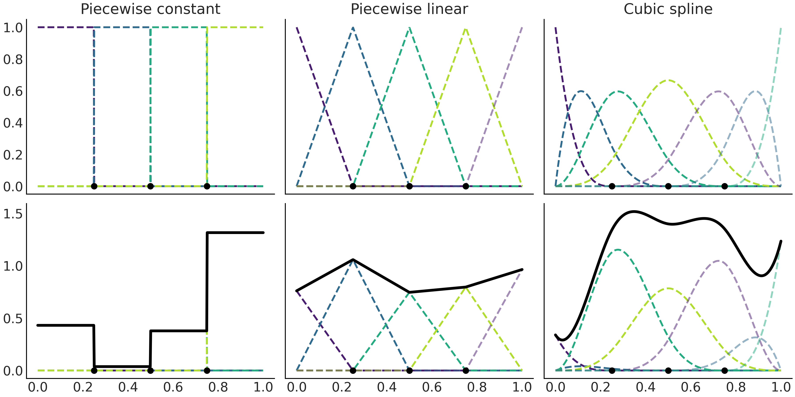

---
jupyter:
  jupytext:
    text_representation:
      extension: .md
      format_name: markdown
      format_version: '1.3'
      jupytext_version: 1.11.2
  kernelspec:
    display_name: Poetry
    language: python
    name: poetry-kernel
---

<!-- #region tags=[] -->
# Splines
<!-- #endregion -->

<!-- #region tags=[] -->
## Imports
<!-- #endregion -->

```python
%config InlineBackend.figure_format="retina"
```

```python
from typing import Sequence

import arviz as az
import matplotlib.pyplot as plt
import numpy as np
import pandas as pd
import patsy
import pymc3 as pm
from patsy.design_info import DesignMatrix
```

## Polynomial regression


Linear model can be written as

$$
\mathbb{E}[Y]= \beta_0 + \beta_1 X
$$

which looks like

$$
\mathbb{E}[Y]= \beta_0 + \beta_1 X + \beta_2 X^2 + \cdots + \beta_m X^m
$$

for a **polynomial regression**.
As we increase the order of the polynomial—$m$—we
increase the flexibility of the curve.
Problem is that polynomials act globally—when
we apply a polynomial of degree $m$
we are saying the relationship between the $Y$ and $X$ is of degree $m$
for the entire dataset.

This can lead to curves that are too flexible,
and prone to overfitting.

<!-- #region tags=[] -->
## Expanding the feature space
<!-- #endregion -->

Polynomial regression
is a method to **expand the feature space**.
Beyond polynomials,
we can expand features as:

$$
\mathbb{E}[Y]= \beta_0 + \beta_1 B_{1}(X_{1}) + \beta_2 B_{2}(X_{2}) + \cdots + \beta_m B_{m}(X_{m})
$$

where $B_i$ are arbitrary functions—**basis
functions**.

Besides polynomials,
basis functions
can be a power of two,
lograrithms,
square root,
etc.

Can use indicator functions
like $I(c_i \leq x_k < c_j)$
to break up the original $\boldsymbol{X}$ predictor into (non-overlapping) subsets
and then fit the polynomial locally—only
inside these subsets.
This is fitting **piecewise polynomials**.


In chart above,
blue line is true function we try to approximate.
Black line are piecewise polynomials of order 1–4—respectively.
Dashed verticals are limits of each subdomain.

Same idea can be extended to more than one predictor,
and be combined with an inverse link function $\phi$.
These are known as **Generalized Additive Models (GAM)**.

$$
\mathbb{E}[Y]= \phi \left(\sum_i^p f(X_i)\right)
$$


## Introducing splines


**Splines** are an atttempt to use flexibility of polynomials
but keep them under control.
A spline needs knots
to split the domain of the variable $\boldsymbol{X}$ into contiguous intervals.
For this purpose a spline is a piecewise polynomial constrained to be continuous—
we enforce two contiguous sub-polynomials to meet at the knots.
If sub-polynomials are of degree $n$
we say the spline is of degree $n$.
Sometimes the splines are referred to by their order—$n + 1$.

Sub-polynomials are known as **Basis splines (B-splines)**.
Any spline function of a given degree
can be constructed as a lineare combination of basis splines of that degree.


As we increse the B-spline degree,
the domain of the B-spline grows.
For a higher degree spline to make sense
we need to define more knots.
B-splines here are restricted to be non-zero only
instide a given interval.

As the number of knots controlling each B-splines grows with the degree
we are not able to define a B-spline near the boundaries.
We can add knots at the boundaries to make up for this.
So if our knots are $(0,1,2,3,4,5)$
and we want to fit a cubic spline,
we actually use $(0,0,0,0,1,2,3,4,5,5,5,5)$.
We now have the 5 necessary knots—$(0,0,0,0,1)$—to
define the first B-spline
and $(0,0,0,1,2)$ to define the second B-spline.
We pad the boundary knots as many times as the degree of the splint.



A linear combination of the B-spline
allows for complex fitting.
We choose:

1. The order of the B-splines
2. The number and location of knots
3. The coefficients to weight each B-spline

The wights are sampled,
so you can have multiple possible combinations over the splines.

Cubic is the most commonly use spline.
They are the lowerst order able to generate smooth enough curves
for most common scenarios.


## Building the design matrix using Patsy

```python
x = np.linspace(0, 1, 20)
knots = [0.25, 0.5, 0.75]


def make_splines(
    x: Sequence[float], knots: Sequence[float], degree: int
) -> DesignMatrix:
    """Create splines using Patsy."""
    splines = patsy.dmatrix(
        f"bs(x, knots=knots, degree={degree}, include_intercept=True) - 1",
        {"x": x, "knots": knots},
    )

    return splines


b0 = make_splines(x, knots=knots, degree=0)
b1 = make_splines(x, knots=knots, degree=1)
b3 = make_splines(x, knots=knots, degree=3)

_, axes = plt.subplots(1, 3, sharey=True, figsize=(20, 7))

for idx, (b, title, ax) in enumerate(
    zip(
        (b0, b1, b3),
        ("Piecewise constant", "Piecewise linear", "Cubic spline"),
        axes,
    )
):
    ax.imshow(b, cmap="cet_gray_r", aspect="auto")
    ax.set_xticks(np.arange(b.shape[1]))
#     ax.set_yticks(np.arange(b.shape[0]))
    ax.set_title(title)

axes[1].set_xlabel("b-splines")
axes[0].set_ylabel("x");
```

```python
np.asarray(b0)
```

```python
np.asarray(b1)
```

```python
np.asarray(b3)
```

For `b0`
we see the design mattix has only 0s or 1s.
The first B-spline is 1 for the first 5 observations,
and 0 otherwise.
The second B-spline
is 0 for the first 5 observations
1 for the second 5,
and 0 again.


## Fitting splines in  PyMC3

```python
data = (
    pd.read_csv(
        "https://raw.githubusercontent.com"
        "/BayesianModelingandComputationInPython/BookCode_Edition1/main"
        "/data/bikes_hour.csv"
    )
    .sort_values(by="hour")
    .assign(
        count_normalized=lambda df: df["count"]
        .sub(df["count"].mean())
        .div(df["count"].std())
    )[::50]
)
_, ax = plt.subplots(figsize=(20, 7))
data.plot.scatter(x="hour", y="count_normalized", ax=ax);
```

```python
num_knots = 6
knot_list = np.linspace(data["hour"].min(), data["hour"].max(), num_knots + 2)[1:-1]
knot_list
```

Above,
boundaries are removed to ensure knots are defined within the data.
This depends on situation—such
as if bulk of data is away from the borders.

```python
b = patsy.dmatrix(
    "bs(cnt, knots=knots, degree=3, include_intercept=True) - 1",
    {"cnt": data["hour"].to_numpy(), "knots": knot_list[1:-1]},
)

with pm.Model() as splines:
    τ = pm.HalfCauchy("τ", 1)
    β = pm.Normal("β", mu=0, sd=τ, shape=b.shape[1])
    μ = pm.Deterministic("μ", var=pm.math.dot(np.asarray(b), β))
    σ = pm.HalfNormal("σ", sigma=1)
    c = pm.Normal("c", mu=μ, sd=σ, observed=data["count_normalized"].values)

    idata_s = pm.sample(1_000, return_inferencedata=True)

_, ax = plt.subplots(figsize=(10, 4))
posterior = idata_s["posterior"].stack(samples=["chain", "draw"])
x = data["hour"]
data_cnt_os = data["count"].std()
data_cnt_om = data["count"].mean()
ax.plot(
    x,
    b * posterior["β"].mean("samples").to_numpy() * data_cnt_os + data_cnt_om,
    ls="--",
)
ax.plot(x, posterior["μ"].mean("samples") * data_cnt_os + data_cnt_om, lw=5);
```

```python
_, ax = plt.subplots(figsize=(10, 4))
data.plot.scatter(x="hour",y="count", alpha=0.3, ax=ax)
az.plot_hdi(x, posterior["μ"].T * data_cnt_os + data_cnt_om, ax=ax);
```

In this data,
hour 0 is equal to 24.
With Patsy,
instead of defining design matrix using `bs`,
use `cc`—a cubic spline that is circular-aware.


## Choosing knots and prior for splines


To choose the number and location of knots,
can use LOO to help pick best model.

```python
Bs = []

num_knots = (3, 6, 9, 12, 18)
for nk in num_knots:
    knot_list = np.linspace(0, 24, nk + 2)[1:-1]
    B = patsy.dmatrix(
        "bs(cnt, knots=knots, degree=3, include_intercept=True) - 1",
        {"cnt": data.hour.values, "knots": knot_list},
    )
    Bs.append(B)

idatas = []
for B in Bs:
    with pm.Model() as splines:
        τ = pm.HalfCauchy("τ", 1)
        β = pm.Normal("β", mu=0, sd=τ, shape=B.shape[1])
        μ = pm.Deterministic("μ", pm.math.dot(np.asfortranarray(B), β))
        σ = pm.HalfNormal("σ", 1)
        c = pm.Normal("c", μ, σ, observed=data["count_normalized"].values)
        idata = pm.sample(1000, return_inferencedata=True)
        idatas.append(idata)

az.compare({f"m_{k}k": v for k, v in zip(num_knots, idatas)})
```

Weight is 0.88 for highest ranked model,
0.12 for lowest ranked,
and 0 everywhere else.
Even when the in between models have better `loo` values,
they contribute little to `m_12k`—while
`m_3k` does.

Instead of uniformly,
knots can be placed based on quantiles.

```python
num_knots = 6
knot_list = np.quantile(data["hour"], np.linspace(0, 1, num_knots))
knot_list
```

### Regularizing prior for splines


Choosing too few knots can lead to underfitting,
too many overfitting.
Can choose a large number of knots with a regularizing prior.

The closer the consecutive $\beta$ coefficients are to each other,
the smoother the function.
Consecutive coefficients share similar domains—if
you drop two consecutive ones,
the sub region loses coverage.
We can choose a prior for $\beta$ coefficients in such a way
that $\beta_{i + 1}$ is correlated to $\beta$.

$$
\begin{aligned}
\begin{split}
\beta_i \sim& \mathcal{N}(0, 1) \\
\tau\sim& \mathcal{N}(0,1) \\
\beta \sim& \mathcal{N}(\beta_{i-1}, \tau) 
\end{split}\end{aligned}
$$

Equivalently,
we can write

$$
\begin{aligned}
\begin{split}
\tau\sim& \mathcal{N}(0, 1) \\
\beta \sim& \mathcal{G}RW(\beta, \tau) 
\end{split}\end{aligned}
$$

```python
knot_list = np.arange(1, 23)

B = patsy.dmatrix(
    "bs(cnt, knots=knots, degree=3, include_intercept=True) - 1",
    {"cnt": data.hour.values, "knots": knot_list},
)

# Not smoothed
with pm.Model() as wiggly:
    τ = pm.HalfCauchy("τ", 1)
    β = pm.Normal("β", mu=0, sd=τ, shape=B.shape[1])
    μ = pm.Deterministic("μ", pm.math.dot(np.asfortranarray(B), β))
    σ = pm.HalfNormal("σ", 1)
    c = pm.Normal("c", μ, σ, observed=data["count_normalized"].values)
    trace_wiggly = pm.sample(1_000, return_inferencedata=False)
    idata_wiggly = az.from_pymc3(
        trace=trace_wiggly,
        posterior_predictive=pm.sample_posterior_predictive(trace_wiggly),
    )

# Smoothed
with pm.Model() as splines_rw:
    τ = pm.HalfCauchy("τ", beta=1)
    β = pm.GaussianRandomWalk("β", mu=0, sigma=τ, shape=B.shape[1])
    μ = pm.Deterministic("μ", var=pm.math.dot(np.asarray(B), β))
    σ = pm.HalfNormal("σ", sigma=1)
    c = pm.Normal("c", mu=μ, sigma=σ, observed=data["count_normalized"].to_numpy())
    trace_splines_rw = pm.sample(1_000, return_inferencedata=False)
    posterior_predictive_splines_rw = pm.sample_posterior_predictive(trace_splines_rw)
    idata_splines_rw = az.from_pymc3(
        trace=trace_splines_rw,
        posterior_predictive=posterior_predictive_splines_rw,
    )

_, ax = plt.subplots(figsize=(10, 4))
data.plot.scatter(x="hour", y="count", ax=ax, alpha=0.1)
ax.plot(
    data["hour"],
    ((idata_wiggly.posterior["μ"] * data_cnt_os) + data_cnt_om).mean(
        dim=["chain", "draw"]
    ),
    color="C1",
    label="Non-regularized",
)
ax.plot(
    data["hour"],
    ((idata_splines_rw.posterior["μ"] * data_cnt_os) + data_cnt_om).mean(
        dim=["chain", "draw"]
    ),
    color="C2",
    label="Regularized",
)
ax.legend();
```
